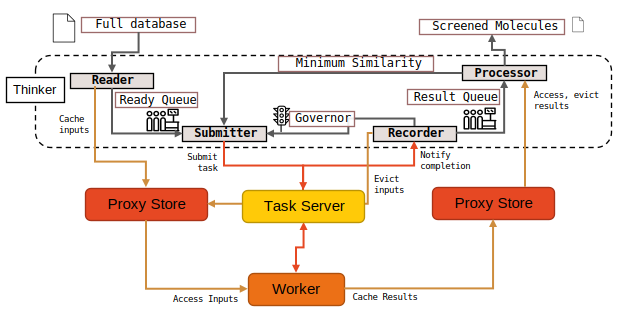

# Screen Search Space

We plan to use large resources of molecules as the basis for a search and want to downselect the list of molecules to only those that are most interesting for later analysis.
Our approach is to find the molecules that are most similar to known molecules using Tanimoto similarity with Morgan fingerprints.

Running the screens on large search spaces is easy with chemoinformatics toolkits, like RDKit, but running them in parallel has a few challenges.
The largest is that storing the entire search space in memory is problematic.
So, we implement an out-of-core strategy where we gradually read molecules from the search space and send them out to workers as tasks complete.
That way, we do not have the whole dataset in memory at any one time.

## Running the Program

The `screen.py` program implements the parallel screening algorithm with [Colmena](https://colmena.rtfd.org). 
It requires a path to the search space of molecules and a description of the molecules we want to compare to as a `.smi` file.

Call `python screen.py --help` for the full options. 

## Implementation

We implement the out-of-core screening algorithm using using agent threads that cooperate to submit screening tasks to workers and finding the top molecules out of the results:

1. **Reader**: Readies molecules to be screened by workers. Reads chunks of molecules from disk and stages them in a ProxyStore server accessible from the workers. Pointers to these chunks are placed in a "Ready Queue" that is consumed by the Submitter thread. The Reader reads then stages more molecules as the queue is consumed from.

1. **Submitter**: Submits tasks to begin execution on the workers. Inputs each task are a pointer to pre-cached molecule data and the similarity value that molecules must exceed to be worth processing. The Submitter maintains a target number of tasks running to workers using a semaphore ("governer") shared with the Receiver.

1. **Receiver**: Performs initial triaging of screening results: (1) marks resources as available on the governor so that the Submitter will submit a new task, (2) adds a pointer to the result data to a "Result Queue," and (3) evicts the input data from the ProxyStore.

1. **Processor**: Updates the list of most-similar molecules using completed tasks. Accesses results from ProxyStore and then evicts the results from that database. Gradually increases the minimum similarity used to screen out molecules at workers (reducing the size of result messages). Once all molecules have been screened, writes results to disk.
